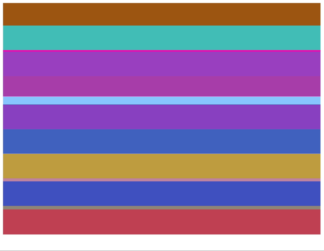
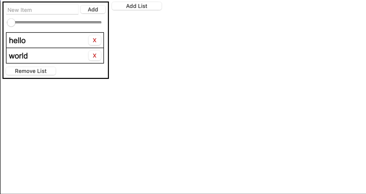

# simple-react-transition

`simple-react-transition` is a powerful library that allows you to compose complex UI animations using CSS transitions.

## Install

```
npm install simple-react-transition
```

## Simple Demo



### Check out the code: https://codesandbox.io/s/simple-demo-s6vg5f

## Advanced Demo



### Check out the code: https://codesandbox.io/s/advanced-demo-w8dq4x

## Basic Example

The API primarily consists of the `Animations` component. 

You pass the `Animations` component an array of `Renderer`s.

```typescript
import { Renderer, Animations } from "simple-react-transition";
import { useState } from "react";

export default function App() {
  const [isVisible, setVisible] = useState(true);

  let renderers: Renderer[];
  if (isVisible) {
    renderers = [
      {
        key: "greeting",
        render: (animationStage) => {
          let opacity: number;
          if (animationStage === "mount" || animationStage === "remove") {
            opacity = 0;
          } else {
            opacity = 1;
          }
          const style = {
            opacity,
            transition: "all 1s" // Must be the same as `duration`
          };
          return <div style={style}>Hello!</div>;
        },
        duration: () => 1000 // Must be the same as the `transition` duration
      }
    ];
  } else {
    renderers = [];
  }

  return (
    <>
      <button onClick={() => setVisible(!isVisible)}>
        {isVisible ? "Hide" : "Show"} Greeting
      </button>
      <Animations renderers={renderers} />
    </>
  );
}
```


Code: https://codesandbox.io/s/basic-demo-7j9dwg

### Learn About CSS Transitions: https://developer.mozilla.org/en-US/docs/Web/CSS/transition

# API

## `AnimationStage`

```typescript
export type AnimationStage = 'mount' | 'add' | 'stable' | 'remove';
```

The `AnimationStage` type is passed to animated components so they can choose how to render themselves based on which stage of the animation cycle they are in.

### `mount`

The `mount` animation stage occurs when the component has just been added to the DOM.

Typically during the `mount` stage, you render the component as the start of its adding animation.

### `add`

The `add` stage occurs while the adding animation for the component is executing.

### `stable`

The `stable` stage occurs when the component has finished its add animation, and also is not being removed from the DOM.

Components might spend most of their lifetime in `stable`.

The `stable` stage my be skipped if the component is removed before the `add` animation is completed.

### `remove`

The `remove` stage occurs while the removal animation is executing.

After the `remove` stage completes, the component is removed from the DOM.

### Typical Lifecycle:

```
mount -> add -> stable -> remove -> (removed)
```

### Lifecycle if Removed Early

```
mount -> add -> remove -> (removed)
```

## `Renderer`

```typescript
export type Renderer = {
    key: string;
    render(stage: AnimationStage): React.ReactNode;
    duration(stage: 'add' | 'remove'): number;
};
```

The `Renderer` defines an element that should be rendered as part of an `Animations` group.

### `key`

Similarly to a React key, uniquely identifies this renderer amongst its peers in the `Animations`.

### `render`

Given an `AnimationStage`, renders the component that will be added to the DOM.

This component should typically also have `key`. While the key should be unique, it doesn't have to be the same as the renderer's key (although it often is).

### `duration`

Defines how long the `add` and `remove` animation stages take, in **milliseconds**.

This should typically be the same duration as your CSS transitions.

You may define the same duration for the `add` and `remove` stages.

You may use a duration of `0` for one or both stages. If you use a duration of 0, the stage still occurs, but only for one frame.

## `Animations`
```typescript
function Animations({ renderers: Array<Renderer> }): JSX.Element;
```
This component takes an array of `Renderers`, and controls their `AnimationStage`s to facilitate the appropriate rendering of the components such that animations are executed.

The first time an `Animations` is rendered, its `renderers` are rendered in stage `stable`. This ensures that animations are not executed when the component initially renders.

# Swapping

